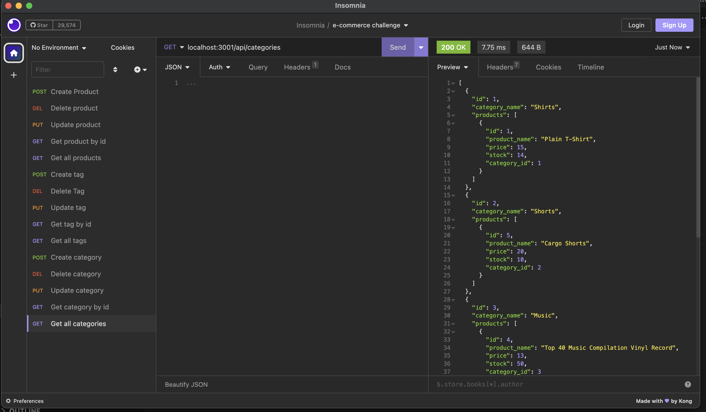

# ecommerce-backend
homework challenge 13

## Description

This project is to create a back end for the user's e-commerce website that uses the latest technologies
so that their company can compete with other e-commerce companies

## Installation

Clone github repo. Install Inquirer, node and sequelize. 

## Usage

Run npm i and run npm i sequelize in the command line. Initiate MySQL in the command line and enter your password. Source the schema.sql generate the ecommerce database. Then run npm run seed to fill the table with the seed information. Next run npm start to initialize. Once it's running, you can view the routes via Insomnia. 

## License
ISC

## Links

Github Repo: https://github.com/saephanhe56/ecommerce-backend
Video Link: https://drive.google.com/file/d/1_-bFnAE_mJLVebQ5-wTv6PguOi95NWBX/view

## Mockup Example Product 
